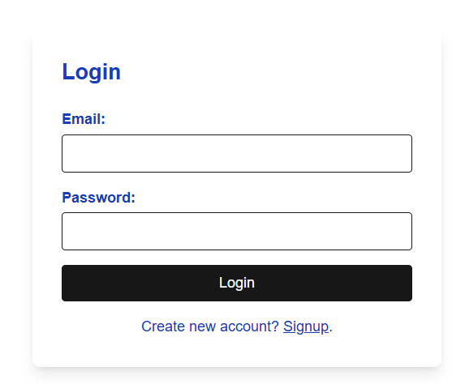
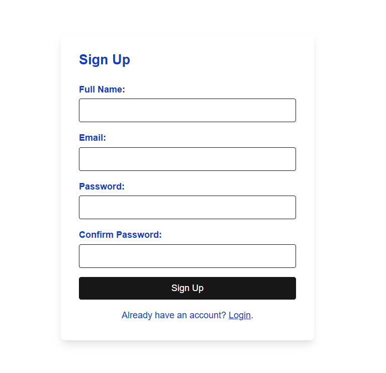
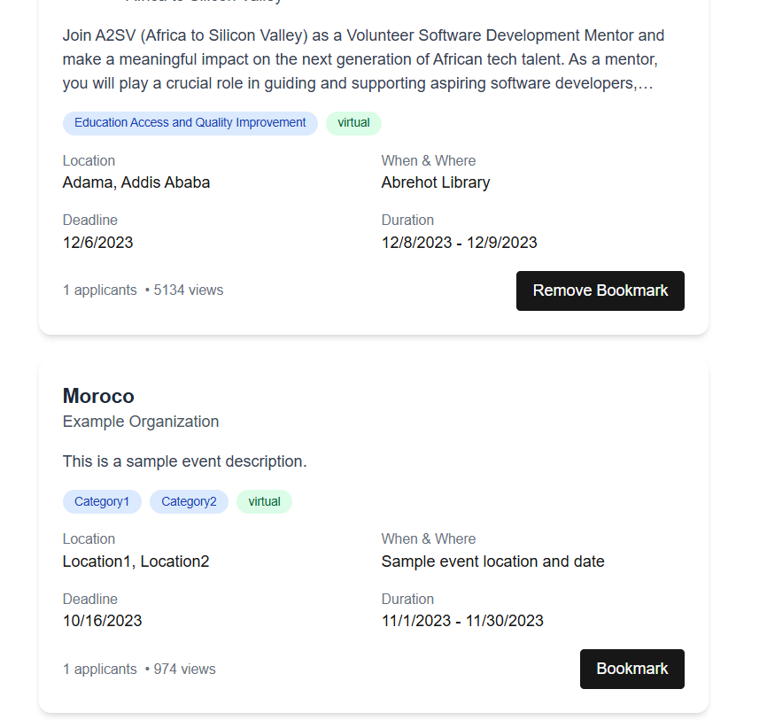
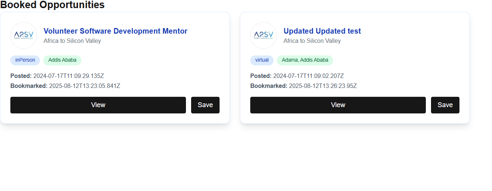

# Opportunity Management Platform

A web application for discovering, bookmarking, and managing volunteer opportunities and events.

## Features

- User authentication (Login/Signup)
- Bookmark opportunities
- View booked opportunities
- Responsive design

## Screenshots

### Login Page


### Signup Page


### Opportunities Dashboard


### Bookmarked Opportunities


## Components

### `OpportunityCard`
Displays opportunity information with bookmark functionality.

### `Booked`
Shows all bookmarked opportunities with sorting/filtering capabilities.

### `LoginPage`
Handles user authentication.

### `SignUpPage`
Handles new user registration.


## Folder Structure
```
src/
├── app/
│   ├── auth/
│   │   ├── login/
│   │   │   └── page.tsx
│   │   ├── signup/
│   │   │   └── page.tsx
│   │   └── verifyemail/
│   │       └── page.tsx
│   ├── booked/
│   │   └── page.tsx
│   └── dashboard/
│       └── page.tsx
└── components/
    └── logout/
        └── index.tsx

```